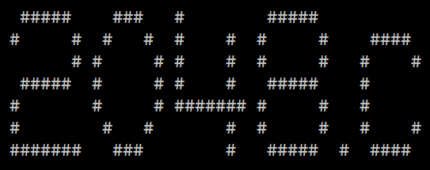

 
 
    
 

    <h4>
       2048.c is a clone of the 2048 puzzle game developed by <a href="https://github.com/danielwojcickoski">Daniel Wojcickoski</a>as a final project for INF01202 at <a href="http://www.ufrgs.br/english/home">UFRGS</a>.
        
        The game was developed in C for Windows using the Conio2 library.
    </h4>

